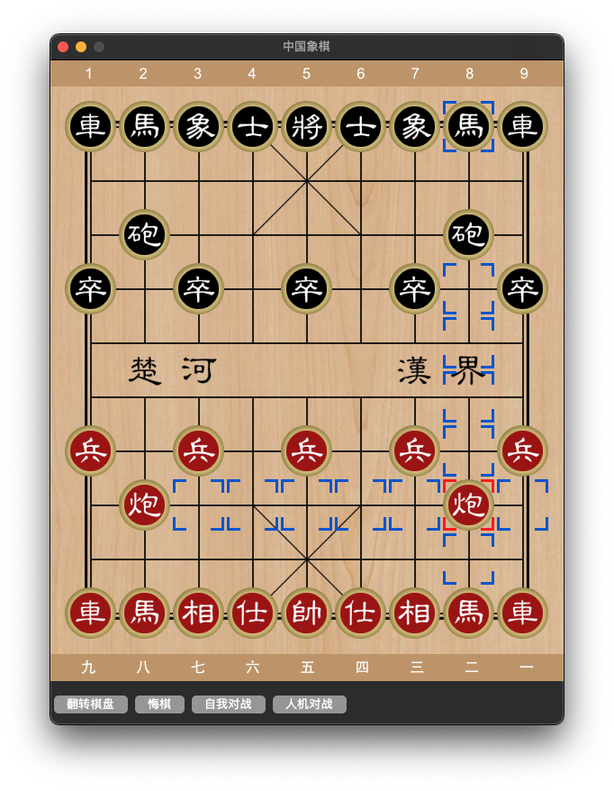
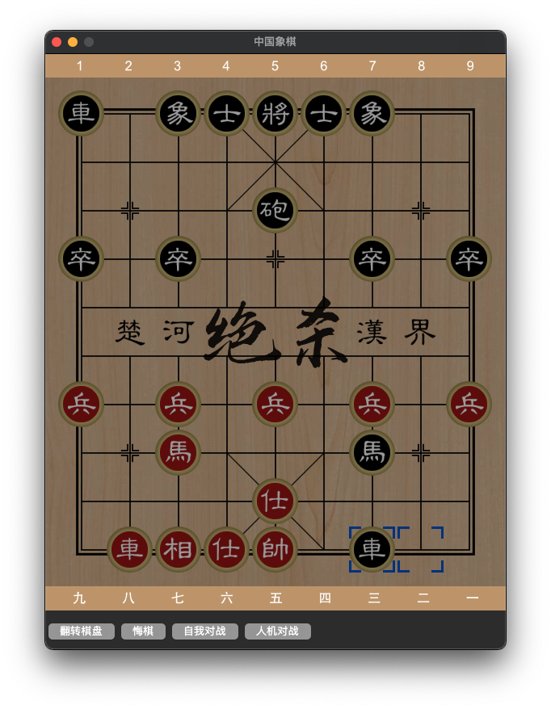

# Python Chinese Chess

AI 部分使用了 [elephantfish](https://github.com/bupticybee/elephantfish)，象棋逻辑部分参考了 [python-chess](https://github.com/niklasf/python-chess)。几乎0依赖，由于 tkinter 无法加载 jpeg 图像，所以需要依赖 Pillow 库。

## Usage

```
pip install Pillow
python gui.py
```

## Screenshots




